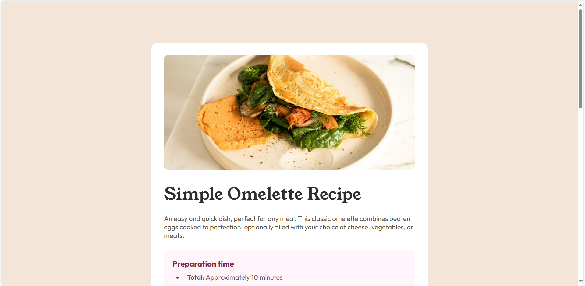

# Frontend Mentor - Recipe page solution

This is a solution to the [Recipe page challenge on Frontend Mentor](https://www.frontendmentor.io/challenges/recipe-page-KiTsR8QQKm). Frontend Mentor challenges help you improve your coding skills by building realistic projects. 

## Table of contents

- [Overview](#overview)
  - [The challenge](#the-challenge)
  - [Screenshot](#screenshot)
  - [Links](#links)
- [My process](#my-process)
  - [Built with](#built-with)
  - [What I learned](#what-i-learned)
  - [Continued development](#continued-development)
  - [Useful resources](#useful-resources)
- [Author](#author)

## Overview

### Screenshot




### Links

- Solution URL: [GitHub](https://github.com/mon01234/recipe-page-main-solution)
- Live Site URL: [GitHub pages](https://mon01234.github.io/recipe-page-main-solution/)

## My process

### Built with

- Semantic HTML5 markup
- CSS custom properties
- Flexbox
- CSS Grid

### What I learned

I learned to break the task into smaller tasks to progress more qiuckly and finish the challenge.

```css
#tr-1, #tr-2, #tr-3 {
    border-bottom: 1px solid hsl(30, 18%, 87%);
}
```

### Continued development

I want to continue focusing on responsive web design. I also want to focus on how padding, margin and width/height really works in CSS because I struggled to achieve my desired result when developing this in the smaller screen. The problem I have faced is with the padding/margin on the small screen, what I did to solve it was to make the width of the main element and cetered it to make it appears that it has padding or margin.

### Useful resources

- [stackoverflow](https://stackoverflow.com/) - This helped me to fix problems that I had faced.
- [w3schools](https://www.w3schools.com/) - This also helped me to fix problems that I had faced.

## Author

- GitHub - [mon01234](https://github.com/mon01234)
- Frontend Mentor - [@mon-68kg](https://www.frontendmentor.io/profile/mon-68kg)
